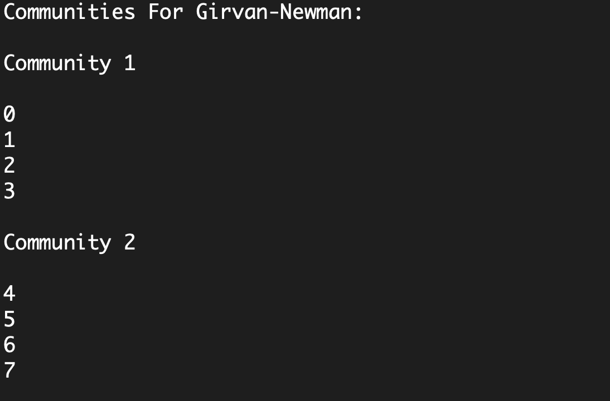

# Project 3 - Community Detection in Networks

By: Braiden Hook and Michael Doherty

Medium Article Links:

https://medium.com/@bghook/community-detection-label-propagation-vs-girvan-newman-part-1-c7f8680062c8

https://medium.com/@mikecamdo/community-detection-label-propagation-vs-girvan-newman-part-2-c2fb78726db9

## Scenario

In this project we impletemented the community detection algorithm proposed by Girvan and Newman on computer randomized graphs and the college football dataset.

## How to build and execute

Follow these steps using the command line to execute the program:

1. Clone the git repo using the command line:

        git clone https://github.com/smu-cs-3353/22s-pa03-girvan-newman-a-loner-s-regret
        
2. Navigate back to the main directory which contains the CMakeLists.txt.
3. Create a build directory with:

        mkdir build

4. cd into the new build folder.
5. Build cmake with:

        cmake ..
        
6. Then to get the executable use:

        cmake --build .
        
7. Lastly to run the program (executable, then the graphml pathname):
  
        ./22s_pa03_girvan_newman_a_loner_s_regret ../RandomGraphs/football.graphml
        
There are graphs available for you to use in the RandomGraphs folder, however you can provide your own as well. It simply needs to be in graphml format.

## Output

After the program is complete, you will receive an output showing the community structure for the inputted graph.

There are two different types of output. The first outputs the community structure while labeling the nodes with integers. The other is specialized for the college football graph.

### Normal Output

This output is for every graph that is not the college football graph (the one in the RandomGraph folder). It will list each community and the vertex ids that are inside said community. There will be two output files, one for girvan-newman, and one for label propagation.
